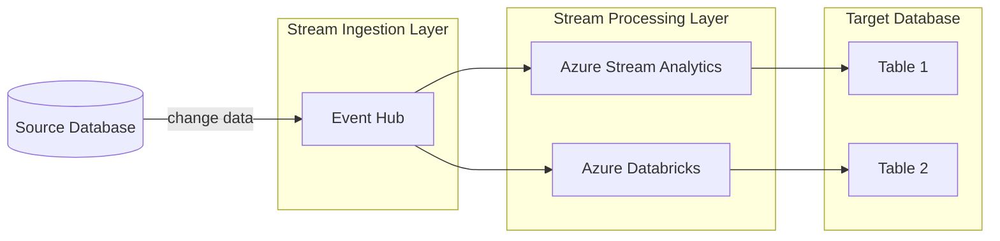

# Overview

This repository contains samples for using Azure Stream Analytics and Azure Databricks to process change data from a relational database (also referred to as change data capture, or CDC). The intent is to provide hands-on comparison of using these two services to process CDC data in a generic manner.

# Scenario

