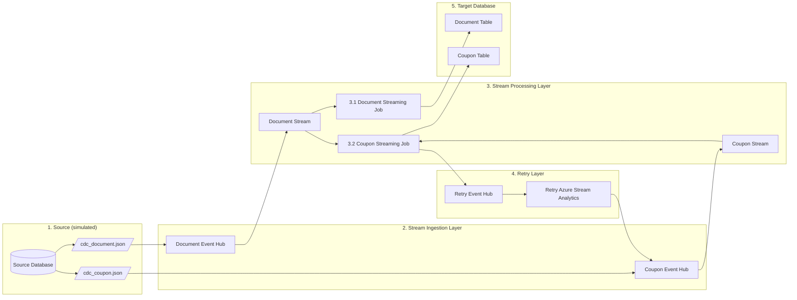

# Overview

This repository contains samples for using Azure Stream Analytics to process change data from a relational database (also referred to as change data capture, or CDC) and land it in a target database.
# Scenario

1. Simulated change data (in JSON format) being generated by a source database. CDC data will be generated for two related tables: **document** and **coupon**
2. The simulated change data for each table will be sent to respective Azure Event Hubs for fast ingestion.
3. Azure Stream Analytics input streams will read from the corresponding Event Hubs
    1. One ASA job will process the document stream, creating a derived column (concatenation of **documentId** and the document **createDatetime**) which will be used as a new primary key in the target database.
    2. Another ASA job will process the coupon stream, adding a reference to the newly-created document primary key as a foreign key.
4. Each of the stream processing services will write to the corresponding target table in the target database.

# Notes on things to be sure to document

- If using a local client tool to connect to PostgreSQL, be sure to add firewall rules for the source IP address

# Useful Resources

- [Time Skew Policies (Azure Stream Analytics) - Stream Analytics Query | Microsoft Learn](https://learn.microsoft.com/en-us/stream-analytics-query/time-skew-policies-azure-stream-analytics)
- [Stream Analytics Query Language Reference - Stream Analytics Query | Microsoft Learn](https://learn.microsoft.com/en-us/stream-analytics-query/stream-analytics-query-language-reference)