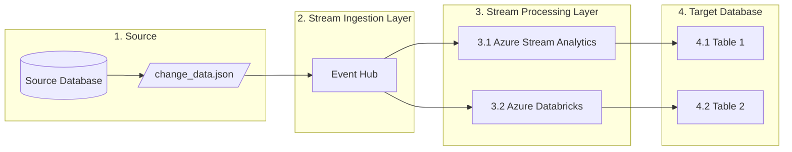

# Overview

This repository contains samples for using Azure Stream Analytics and Azure Databricks to process change data from a relational database (also referred to as change data capture, or CDC). The intent is to provide hands-on comparison of using these two services to process CDC data in a generic manner.

# Scenario

1. Simulate change data (in JSON format) being generated by a source database.
2. The simulated change data will be sent to an Azure Event Hub for fast ingestion.
3. From the ingestion layer, the data will be sent to two different stream processing services:
    1. Azure Stream Analytics
    2. Azure Databricks, which will use Spark Strutured Streaming
4. Each of the stream processing services will write to a separate table (to isolate the workloads) within the target database.
    1. Table 1 is the target for the Azure Stream Analytics job.
    2. Table 2 is the target for the Azure Databricks job.